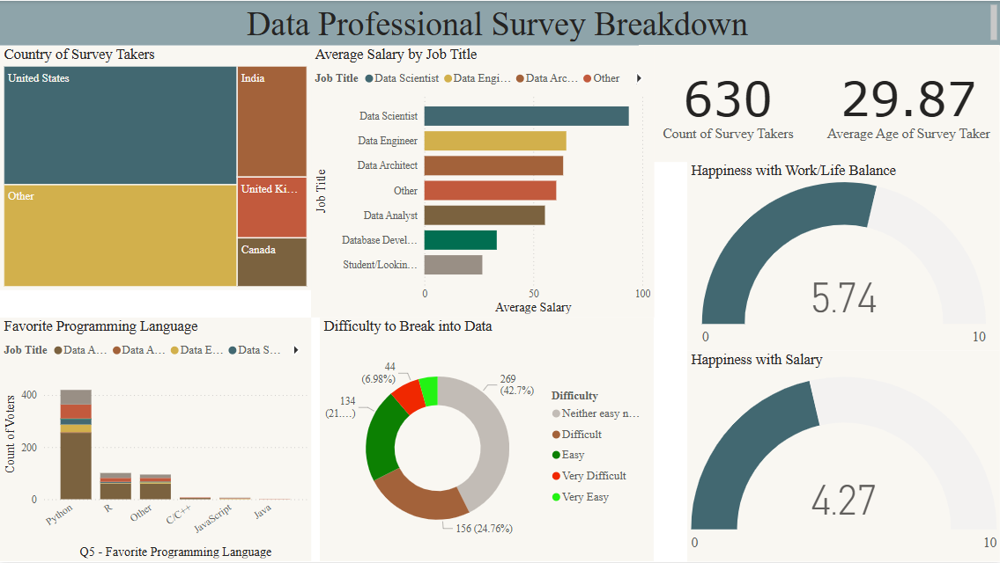

# 📊 Data Professionals Survey Analysis  

## 📌 Overview  
This project analyzes survey data from **600+ data professionals** collected via LinkedIn, Twitter, and other platforms.  
The goal was to gain insights into **job roles, salaries, technologies, job satisfaction, and career trends** in the data industry.  

## 🔄 Project Workflow  
✔ **Data Collection** – Gathered responses from a diverse group of data professionals.  
✔ **Data Cleaning & Processing** – Used **Power Query** to clean and transform raw survey data.  
✔ **Data Analysis & Visualization** – Used **Power BI** to create interactive and insightful visualizations.  
✔ **Key Insights** – Discovered trends in salaries, job roles, preferred technologies, and industry demands.  

## 🛠 Tech Stack & Tools Used  
- **Excel** – Data cleaning & initial processing  
- **Power Query** – Data transformation and organization  
- **Power BI** – Data visualization & dashboard creation  
- **GitHub** – Project sharing  

## 📊 Key Findings & Insights  
📌 **Salary Trends** – Found correlations between experience levels and salary brackets.  
📌 **Popular Tools** – Identified the most widely used tools and technologies.  
📌 **Career Satisfaction** – Analyzed job satisfaction levels across different roles.  
📌 **Industry Demand** – Discovered emerging skills and hiring trends.  

## 📸 Visualizations  
Here are some snapshots of the Power BI dashboards:  
👉 

## 🖥 How to View the Dashboard  
1️⃣ **Download** the Power BI file (`.pbix`) from this repo.  
2️⃣ **Open** it in **Power BI Desktop** to explore the insights interactively.  

---

⭐ **If you find this project useful, consider giving it a star!** 🌟  
